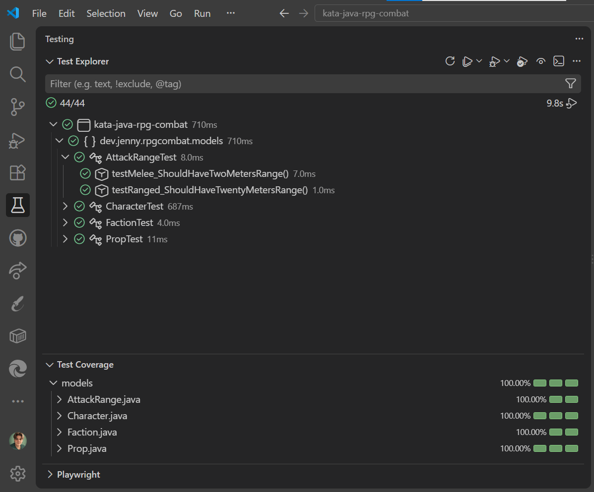
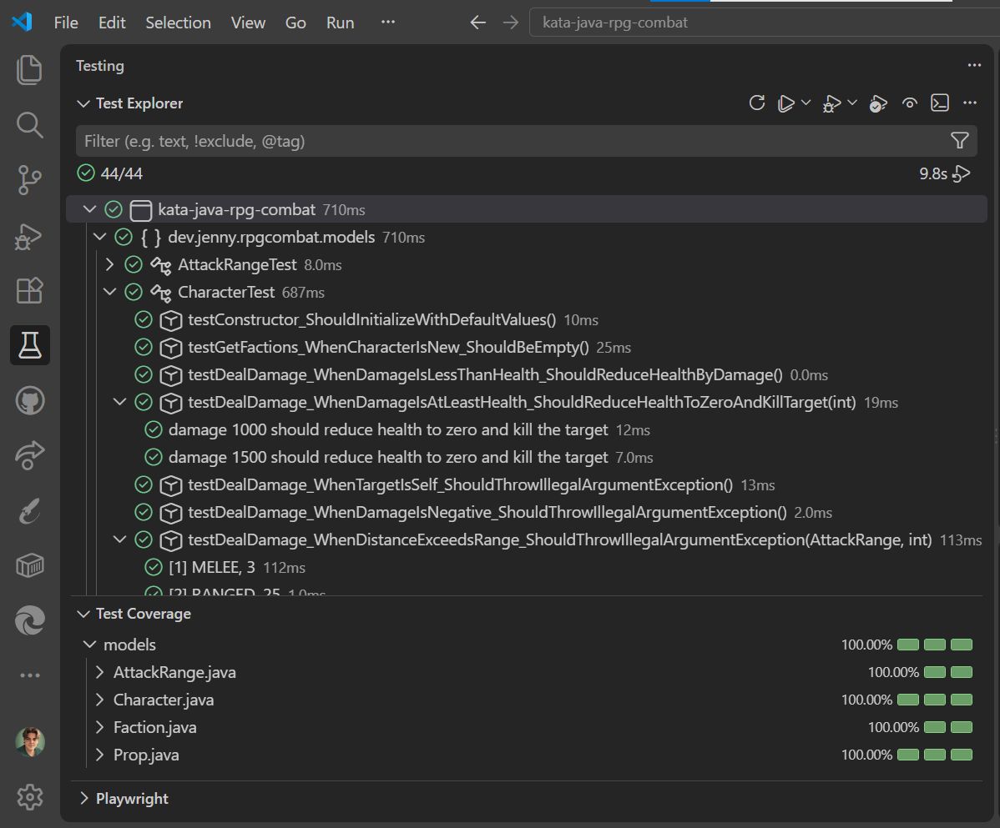
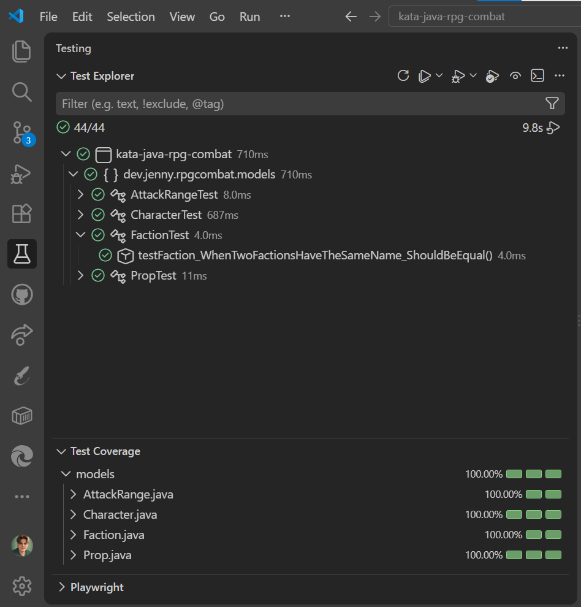
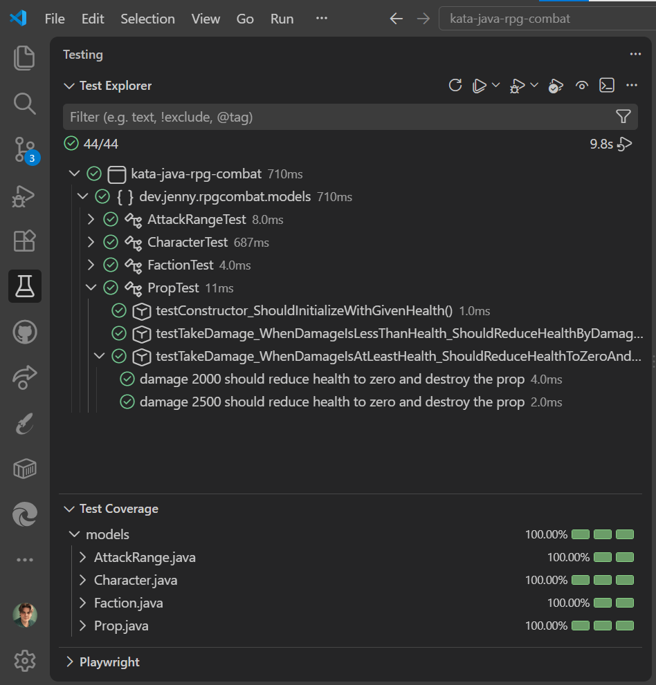

# ⚔️ Kata RPG Combat – Combate por turnos en Java

> Aquí no hay diplomacia: si tu `health` llega a 0, no hay resurrección que valga

Kata centrado en modelar por TDD las reglas de combate de un juego de rol: personajes con vida, nivel y facciones, daño y curación, rango de ataque y objetos no-personaje. Desarrollado siguiendo **TDD** con **JUnit 5 + Hamcrest**, y cobertura de tests medida con **JaCoCo**.

---

## 📑 Índice

- [Descripción](#-descripción)
- [Cómo reproducir el proyecto](#-cómo-reproducir-el-proyecto)
- [Estructura del repositorio](#-estructura-del-repositorio)
- [Testing](#-testing)
- [Tecnologías](#-tecnologías)
- [Autora](#-autora)

---

## 📋 Descripción

Kata RPG Combat parte de la clase `Character`, que expone métodos para infligir y recibir daño, curarse a sí mismo, subir de nivel (con modificadores de daño según la diferencia de nivel con el objetivo), atacar dentro de un rango de combate (cuerpo a cuerpo o a distancia), unirse a facciones, y dañar objetos no vivos como props.

Desarrollado en 5 iteraciones progresivas:

**Iteración 1 — Atributos básicos**

El enunciado dice que todo personaje nace con 1000 de vida, nivel 1 y vivo, y que puede recibir daño hasta morir o curarse sin superar el máximo.

La solución que apliqué fue crear una clase `Character` con esos tres valores por defecto, un método `dealDamage()` que resta vida con un límite inferior de 0, y un método `heal()` que suma vida con un límite superior de 1000.

El estado vivo/muerto no lo guardo como un campo aparte: lo calculo con `isAlive()` a partir de la vida actual, para que nunca pueda desincronizarse.

**Iteración 2 — Restricciones y modificadores de nivel**

El enunciado añade que un personaje no puede dañarse a sí mismo ni curar a otro que no sea él mismo, y que el daño sube o baja un 50% según la diferencia de nivel.

Para eso añadí validaciones al principio de `dealDamage()` y `heal()` que lanzan `IllegalArgumentException` con un mensaje claro de por qué falla.

El cálculo del modificador de nivel lo separé en su propio método, `calculateModifiedDamage()`, para no mezclarlo con las validaciones.

**Iteración 3 — Rango de ataque**

El enunciado pide que los personajes cuerpo a cuerpo lleguen a 2 metros y los de distancia a 20, y que haya que estar dentro de ese rango para dañar a alguien.

Representé los dos tipos de rango con un enum, `AttackRange`, en vez de manejar los metros como números sueltos.

Añadí una sobrecarga de `dealDamage()` que también recibe la distancia y lanza `IllegalArgumentException` si supera el rango, sin tocar la versión que ya tenía.

**Iteración 4 — Facciones**

El enunciado dice que los personajes pueden unirse a facciones, que los de la misma son aliados, y que los aliados no pueden dañarse pero sí curarse entre ellos.

Creé un record `Faction` y un método `isAllyOf()` que comprueba si dos personajes comparten alguna facción.

Reutilizo `isAllyOf()` tanto en `dealDamage()` (que ahora lanza `IllegalStateException` si el objetivo es un aliado) como en `heal()`, que ahora también permite curar a un aliado.

**Iteración 5 — Objetos no-personaje (props)**

El enunciado pide poder dañar objetos del escenario que no se curan, no atacan ni pertenecen a ninguna facción, y que se destruyen al llegar a 0 de vida.

Creé una interfaz `Damageable` (`getHealth`, `takeDamage`, `isDestroyed`) que implementan tanto `Character` como la nueva clase `Prop`.

Cambié `dealDamage()` para que acepte cualquier `Damageable`, usando `instanceof Character` solo donde hacen falta reglas exclusivas de personajes. En este RPG hasta los árboles son `Damageable`.

<details>
<summary><strong>Enunciado completo</strong></summary>

**Kata RPG Combat**

Background This is a fun kata that has the programmer building simple combat rules, as for a role-playing game (RPG). It is implemented as a sequence of iterations. The domain doesn't include a map kills or any other character sapart from their ability to damage and heal one another.

**Requiered**

- Minimum Java 21

**DevDependency**

- JUnit
- Hamcrest

**Installation**

Just clone the Kata

**Instructions**

Complete each iteration before reading the next one. 2. It's recommended you perform this kata with a pairing partner and while writing tests.

1. Iteration One:
    - All Characters, when created, have:
        * Health, starting at 1000
        * Level, starting at 1
        * May be Alive or Dead, starting Alive (Alive may be a true/false)
    - Characters can Deal Damage to Characters.
        * Damage is subtracted from Health
        * When damage received exceeds current Health, Health becomes 0 and the character dies
    - A Character can Heal a Character.
        * Dead characters cannot be healed
        * Healing cannot raise health above 1000

2. Iteration Two:
    - A Character cannot Deal Damage to itself.
    - A Character can only Heal itself.
    - When dealing damage:
        * If the target is 5 or more Levels above the attacker, Damage is reduced by 50%
        * If the target is 5 or more levels below the attacker, Damage is increased by 50%

3. Iteration Three:
    - Characters have an attack Max Range.
    - Melee fighters have a range of 2 meters.
    - Ranged fighters have a range of 20 meters.
    - Characters must be in range to deal damage to a target.

```
Retrospective:
    - Are you keeping up with the requirements? Has any iteration been a big challenge?
    - Do you feel good about your design? Is it scalable and easily adapted to new requirements?
    - Is everything tested? Are you confident in your code?
```

4. Iteration Four:
    - Characters may belong to one or more Factions.
        * Newly created Characters belong to no Faction.
    - A Character may Join or Leave one or more Factions.
    - Players belonging to the same Faction are considered Allies.
    - Allies cannot Deal Damage to one another.
    - Allies can Heal one another.

5. Iteration Five:
    - Characters can damage non-character things (props).
        * Anything that has Health may be a target
        * These things cannot be Healed and they do not Deal Damage
        * These things do not belong to Factions; they are neutral
        * When reduced to 0 Health, things are Destroyed
        * As an example, you may create a Tree with 2000 Health

```
Retrospective
    - What problems did you encounter?
    - What have you learned? Any new technique or pattern?
    - Share your design with others, and get feedback on different approaches.
```

</details>

[Volver al índice](#-índice)

---

## 🚀 Cómo reproducir el proyecto

### Requisitos previos

| Herramienta                                                   | Requisito                | Guía de instalación                                                                                       |
| ------------------------------------------------------------- | ------------------------ | --------------------------------------------------------------------------------------------------------- |
| [JDK 21](https://www.oracle.com/java/technologies/downloads/) | Instalado y en el `PATH` | [Ver guía](https://docs.oracle.com/en/java/javase/21/install/overview-jdk-installation.html)              |
| [Apache Maven](https://maven.apache.org/download.cgi)         | Instalado y en el `PATH` | [Ver guía](https://maven.apache.org/install.html)                                                         |
| [Git](https://git-scm.com/downloads)                          | Instalado                | [Ver guía](https://git-scm.com/book/es/v2/Inicio---Sobre-el-Control-de-Versiones-Instalaci%C3%B3n-de-Git) |

### Pasos

**1. Comprueba que tienes Java y Maven instalados** (si algún comando no se reconoce, instálalo desde los enlaces de _Requisitos previos_):

```bash
java --version
mvn --version
```

**2. Clona el repositorio:**

```bash
git clone https://github.com/Jennydev-25/kata-java-rpg-combat.git
```

**3. Entra en la carpeta del proyecto:**

```bash
cd kata-java-rpg-combat
```

**4. Ejecuta los tests** (compila y genera el reporte de cobertura de JaCoCo):

```bash
mvn test
```

El reporte de cobertura se genera en `target/site/jacoco/index.html`, que puedes abrir en el navegador

[Volver al índice](#-índice)

---

## 📁 Estructura del repositorio

```text
kata-java-rpg-combat/
├── assets/
│   └── images/
│       └── test-explorer/
│           ├── attack-range-tests.png
│           ├── character-tests.png
│           ├── faction-tests.png
│           └── prop-tests.png
├── src/
│   ├── main/java/dev/jenny/rpgcombat/models/
│   │   ├── AttackRange.java
│   │   ├── Character.java
│   │   ├── Damageable.java
│   │   ├── Faction.java
│   │   └── Prop.java
│   └── test/java/dev/jenny/rpgcombat/models/
│       ├── AttackRangeTest.java
│       ├── CharacterTest.java
│       ├── FactionTest.java
│       └── PropTest.java
├── .editorconfig
├── .gitignore
├── pom.xml
└── README.md
```

[Volver al índice](#-índice)

---

## 🧪 Testing

42 tests en total, repartidos en las 4 clases del dominio. Cubren tanto los casos felices como cada validación y excepción del enunciado.

### `AttackRangeTest`

`AttackRangeTest` contiene 2 tests para comprobar los metros de cada tipo de rango de ataque.

| Test                                     | Escenario                               |
| ---------------------------------------- | --------------------------------------- |
| `testMelee_ShouldHaveTwoMetersRange`     | El rango cuerpo a cuerpo es de 2 metros |
| `testRanged_ShouldHaveTwentyMetersRange` | El rango a distancia es de 20 metros    |



### `CharacterTest`

`CharacterTest` contiene 35 tests para cubrir todo el comportamiento de `Character`: crear, dañar, curar, facciones y destrucción. Los nombres se muestran recortados hasta el escenario (`_When...`); la parte final (`_Should...`) no se repite porque ya la explica la columna de al lado — el nombre completo está en el código y en la captura de abajo.

| Test                                                   | Escenario                                                          |
| ------------------------------------------------------ | ------------------------------------------------------------------ |
| `testConstructor`                                      | Un personaje nuevo tiene 1000 de vida, nivel 1 y está vivo         |
| `testGetFactions_WhenCharacterIsNew`                   | Un personaje nuevo no pertenece a ninguna facción                  |
| `testDealDamage_WhenDamageIsLessThanHealth`            | El daño se resta de la vida del objetivo                           |
| `testDealDamage_WhenDamageIsAtLeastHealth`             | Con daño de 1000 o 1500, la vida llega a 0 y el personaje muere    |
| `testDealDamage_WhenTargetIsSelf`                      | No se puede dañar a uno mismo                                      |
| `testDealDamage_WhenDamageIsNegative`                  | El daño no puede ser negativo                                      |
| `testDealDamage_WhenDistanceExceedsRange`              | Con MELEE a 3m o RANGED a 25m (fuera de rango), no se puede dañar  |
| `testDealDamage_WhenDistanceIsWithinRange`             | Con MELEE a 2m o RANGED a 15m (dentro de rango), el daño se aplica |
| `testDealDamage_WhenTargetIsAlly`                      | No se puede dañar a un aliado de la misma facción                  |
| `testDealDamage_WhenTargetIsAtLeast5Higher`            | Si el objetivo tiene 5+ niveles más, el daño se reduce a la mitad  |
| `testDealDamage_WhenAttackerIsAtLeast5Higher`          | Si el atacante tiene 5+ niveles más, el daño aumenta un 50%        |
| `testDealDamage_WhenTargetIsProp`                      | Un personaje puede dañar a un `Prop` igual que a otro personaje    |
| `testHeal_WhenTargetIsAlive`                           | Un personaje vivo puede curarse a sí mismo                         |
| `testHeal_WhenTargetIsNeitherSelfNorAlly`              | No se puede curar a alguien que no sea uno mismo o un aliado       |
| `testHeal_WhenAmountIsNegative`                        | La cantidad a curar no puede ser negativa                          |
| `testHeal_WhenTargetIsDead`                            | No se puede curar a un personaje muerto                            |
| `testHeal_WhenNewHealthExceedsMax`                     | Curar 500 o 700 nunca sube la vida por encima de 1000              |
| `testHeal_WhenTargetIsAlly`                            | Un personaje puede curar a un aliado de su misma facción           |
| `testJoinFaction_WhenJoiningOneOrMoreFactions`         | Unirse a una o varias facciones las añade al personaje             |
| `testLeaveFaction_WhenLeavingOneOrMoreFactions`        | Dejar una o varias facciones las quita del personaje               |
| `testIsAllyOf_WhenCharactersShareOrDoNotShareFactions` | Dos personajes son aliados solo si comparten alguna facción        |
| `testTakeDamage_WhenDamageIsLessThanHealth`            | El daño directo también resta vida correctamente                   |
| `testTakeDamage_WhenDamageIsAtLeastHealth`             | Un daño igual o mayor que la vida deja al personaje destruido      |
| `testIsDestroyed_WhenCharacterIsAlive`                 | Un personaje vivo no está destruido                                |



### `FactionTest`

`FactionTest` contiene 1 test para comprobar la igualdad entre dos facciones con el mismo nombre.

| Test                                         | Escenario                                     |
| -------------------------------------------- | --------------------------------------------- |
| `testFaction_WhenTwoFactionsHaveTheSameName` | Dos facciones con el mismo nombre son iguales |



### `PropTest`

`PropTest` contiene 4 tests para cubrir la creación de un prop y cómo recibe daño hasta ser destruido. Igual que en `CharacterTest`, los nombres se muestran recortados hasta el escenario.

| Test                                        | Escenario                                                            |
| ------------------------------------------- | -------------------------------------------------------------------- |
| `testConstructor`                           | Un prop nuevo tiene la vida indicada en el constructor               |
| `testTakeDamage_WhenDamageIsLessThanHealth` | El daño se resta de la vida del prop                                 |
| `testTakeDamage_WhenDamageIsAtLeastHealth`  | Con daño de 2000 o 2500, la vida llega a 0 y el prop queda destruido |



[Volver al índice](#-índice)

---

## 🛠️ Tecnologías

- **[Java 21](https://www.oracle.com/java/technologies/downloads/)** — Lenguaje de programación del proyecto
- **[Apache Maven](https://maven.apache.org/)** — Gestor de dependencias y construcción del proyecto
- **[JUnit 5](https://junit.org/junit5/)** — Framework de tests unitarios
- **[Hamcrest](https://hamcrest.org/JavaHamcrest/)** — Librería de matchers para aserciones legibles
- **[JaCoCo](https://www.jacoco.org/jacoco/)** — Medición de la cobertura de tests
- **[Visual Studio Code](https://code.visualstudio.com/)** — Editor usado para desarrollar y gestionar el proyecto
- **[Markdown](https://www.markdownguide.org/)** — Lenguaje de marcado para el README
- **[Git](https://git-scm.com/)** / **[GitHub](https://github.com/)** — Control de versiones y alojamiento del proyecto

---

## 👩‍💻 Autora

**[Jenny Sánchez Requejo](https://github.com/Jennydev-25)**

[Volver arriba](#-kata-rpg-combat--combate-por-turnos-en-java)
